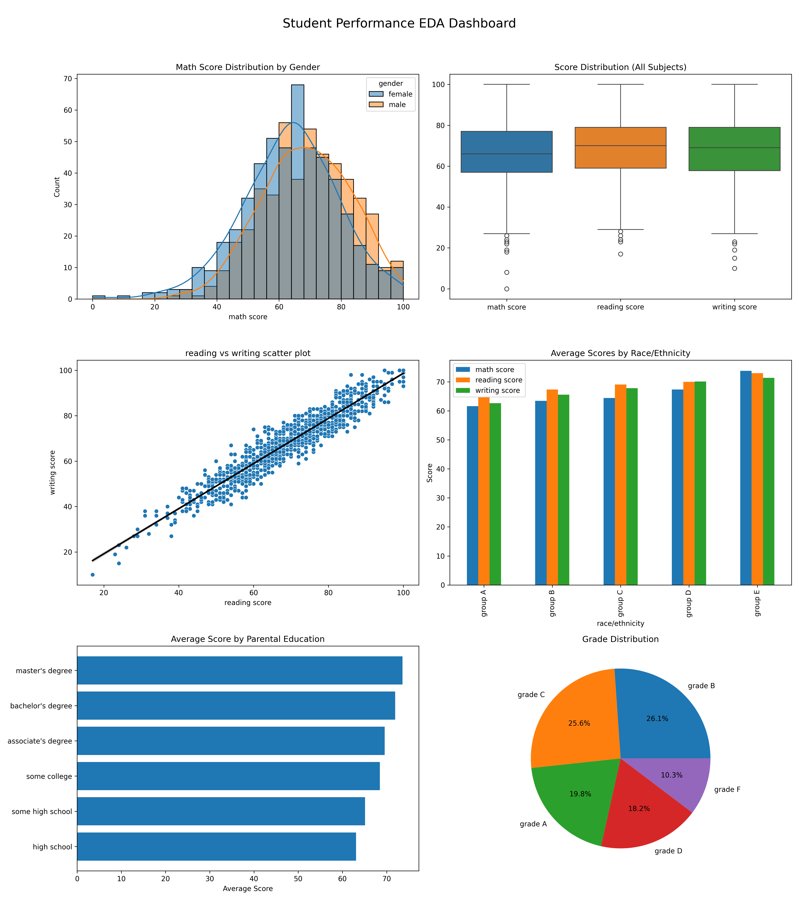

# 📊 Student Performance Analysis (EDA Project)

## 👤 Author
Asadullah

---

## 📌 Project Title
Student Performance Data Analysis using Python (EDA Project)

---

## 📂 Dataset Used
Students Performance Dataset (Math, Reading, Writing Scores with demographic and academic factors)

---

## 🔍 Key Findings

- Reading and writing scores are highly correlated, showing strong dependency between language skills.  
- Math performance is consistently lower and shows higher difficulty compared to other subjects.  
- Test preparation significantly improves student performance across all subjects, especially writing.

---

## 🛠️ Tools & Libraries Used

- Python  
- Pandas  
- NumPy  
- Matplotlib  
- Seaborn  

---

## 📊 Best Visualization

Below is one of the most important insights from the analysis:

---

## 📈 Project Summary
This project explores how different factors such as gender, parental education, and test preparation affect student academic performance. It includes statistical analysis, feature engineering, and data visualization to extract meaningful insights from raw data.

---

## 🚀 Key Skills Demonstrated

- Exploratory Data Analysis (EDA)  
- Data Visualization  
- Feature Engineering  
- Statistical Analysis  
- Data Storytelling  

---

## 📬 Contact
Open to feedback, collaboration, and data-related opportunities.
